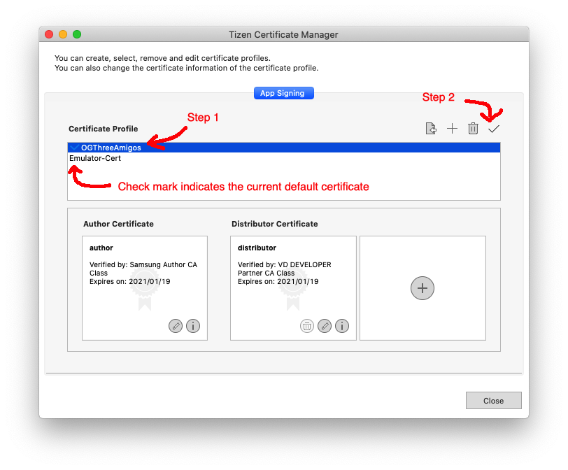

= Guide to Tizen
// Fix for linking to sections in PDF and GitHub
:idprefix:
:idseparator: -
// Give captions icons
ifdef::env-github[]
:tip-caption: :bulb:
:note-caption: :information_source:
:important-caption: :heavy_exclamation_mark:
:caution-caption: :fire:
:warning-caption: :warning:
endif::[]
ifndef::env-github[]
:icons: font
endif::[]
// Enable table of contents and allow different ToC placement
:toc:
:toc-placement!:

*Turn back now!* +
Many a developer and TV have lost their minds while attempting to develop on Tizen.

_This document is dedicated to all the Tizen TVs that hath fallen to insanity._

// Table of contents goes here
toc::[]
// Force a page break
<<<

== Installing Tizen Studio

The existing <<#engine-documentation,Engine Documentation>> gives a good set of instructions for installing Tizen Studio with one note below.

NOTE: Install the latest version on Tizen Studio, despite what the documentation says!

== Certificates

=== Importing Shared Certificates

Using our shared certificates is good practice because it avoids many of the common issues that cause widgets to fail to install.

To import a shared certificate:

. Download the certificate zip file for the target TV from link:https://drive.google.com/drive/folders/1DblKMQ6UEPAZltzKkqWvDXUXzX46wYpz?usp=sharing[here]
. Unzip the contents into _~/SamsungCertificate_
. Open the _Certificate Manager_
. Click the _Plus_ to create a new certificate
. Select _Samsung_
. Select _TV_
. Click _Next_
. Select _Create a new certificate profile_ and enter a _Certificate profile name_
. Click _Next_
. Select _Select an existing author certificate_
. Click _Next_
. Click _Browse_
. Navigate to the folder you unzipped in the previous step
. Select the _author.p12_ file
. Fill the _Password_ field with "password"
. Click _Next_
. Select _Select an existing distributor certificate_
. Click _Browse_
. Navigate to the folder you unzipped in the previous step
. Select the _distributor.p12_ file
. Fill the _Password_ field with "password"
. Click _Finish_
. The certificate should have been imported and set as the default

NOTE: The certificates may be moved into the GitHub repository in the future.

=== Setting the Default Certificate

WARNING: The build arguments and environment variables for specifying a specific certificate to sign a widget are broken! As of time of writing, you must use the _Certificate Manager_!

To set a default certificate follow:

. Open _Certificate Manager_
. Highlight the certificate you want to set as default
. Click the _Checkmark_ button (on the upper right side of the window)

NOTE: The little blue checkmark to the left of a certificate's name shows which one is the default.

=== Generating a New Certificate

WARNING: You should use the shared certificates if they are available!

This is not done very often so I will link to the <<#engine-documentation,Engine Documentation>>.

Here are a few tips when following the documentation:

* The certificate needs to be a Samsung Certificate
** The Tizen ones stopped working many moons ago and none of the elders know why
* TVs need to be whitelisted on a certificate **when the certificate is created!**
** Corollary: TVs cannot be added to an existing certificate
* Any TVs that are connected when creating a certificate will have their DUIDs automatically populated
* When creating the _Distributer Certificate_ you need to change _Privilege_ to _"Partner"_

=== Installing the Certificate on a TV

NOTE: If you are using the pre-made certificates then this step is likely not necessary.

. Make sure the certificate you want to install is set as the default certificate (see guide <<#setting-the-default-certificate,here>>)
. Open _Device Manager_
. Connect to the TV (see <<#development-computer-connection,Development Computer Connection>>)
. Right click the TV in the list of connected devices
. Click _Permit to install applications_

== Connecting to a TV

There are two main steps to connecting to a Tizen TV.

. The TV must be pointing to the development computer's IP (see <<#enabling-developer-mode,Enabling Developer Mode>>)
. The development computer needs to actually connect to the TV (see <<#connecting-development-computer-to-pc, Connecting Development Computer to TV>>)

=== Enabling Developer Mode

IMPORTANT: You will need an IR remote for this!

To enable developer mode on the TV follow these steps:

. Press the _Home_ button on the remote
. Go to the _Apps_ screen on the TV
. Press _1, 2, 3, 4, 5_ on a keyboard or IR remote
. Change _Development Mode_ to _On_
. Enter the IP address of the development computer
. Restart the TV by holding the _Power_ button for 3 seconds

WARNING: The IP address of the TV and the development computer will likely change when they are rebooted!

=== Connecting Development Computer to TV

==== Getting the TV's IP Address

You will need to connect to the TV with its IP address. To get the TV's IP Address:

. Press the _Home_ button
. Navigate to _Settings_ (the gear icon hidden in the hamburger menu)
. Navigate to _General_
. Navigate to _Network_
. Navigate to _Network Status_
. Wait for the network test to finish
. Navigate to _IP Settings_

==== Development Computer Connection

. Open up _Device Manager_ (this was installed along with Tizen Studio)
. Click the _Remote Device Manager_ button (phone connected to laptop logo on the upper right side of the window)
. You can either:
.. Click _Scan Devices_ and look for the IP of your TV
.. Or click _Add Devices_ and enter the IP you got in the previous section
. Click the toggle button under the _Connection_ column on the TV you are using

=== Troubleshooting Connection

If you were able to connect previously and are unable to connect now, the most likely cause is that the IP address of the TV or development computer have changed. Follow the steps above again and double check the IPs have not changed on either device.

== Building the Tizen Widget

Building the Tizen widget is similar to building on any other platform and instructions are also provided in the project's README.

=== Generating

Run the following command to generate the project:

`./generate.rb -p tizen-nacl -m Developer -c [Release, Debug]`

=== Building

Run the following command to build the widget:

`./build.rb -b build/tizen-nacl/[Release, Debug]/`

== Installing the Tizen Widget on a TV

Need to be connected tp the TV before the app can be installed. It is easiest to only connect to one TV at a time, that way you don't need to specify the target for the install command.

I would recommend using the `device-manager` for connecting to the TVs.

`tizen install -n build/tizen-nacl/[Release, Debug]/localnow-[Release, Debug].wgt`

NOTE: The parameter is the path to the widget (__.wgt__) file itself!

=== Why is the Widget not Installing?

==== Certificate Issues

* Make sure you are using the correct certificate set as default
** You can see what certificate was used to sign the package in the last few lines of the build output
** To change the default certificate see <<#setting-the-default-certificate,Setting the Default Certificate>>
* Make sure the TV is whitelisted on the certificate you are using
* Make sure that the certificate is installed on the TV

==== Storage Issues

Error 116 means there is not enough storage on TV to install the widget.

* The first thing you can try is to build a release widget. Release builds are much smaller than debug builds and debug builds aren't very useful without a debug TV.

NOTE: Release builds will suppress `YI_LOGD(...)` but that can be worked around.

* If that fails see <<#clearing-storage-on-the-tv,Clearing Storage on the TV>>

== Clearing Storage on the TV

This section was previously titled, *"Why the Hell is the Widget not Installing!?"*

The main issue we have encountered when trying to install widgets onto TVs is the surprising lack of storage available on them! The amount of storage required for each widget varies, but you will need about 50mb for the You.I Engine alone. This section will walk through all the ways we have found to maximize the amount of storage available on the TV.

=== Show Me the Magic

There is an ancient command passed down from Tizen developers before. It seems to work on some TVs and not on others -- perhaps newer TVs are immune to this incantation. It seems to cause the TV to forget the widget file that was last in its memory.

Enough talk! The spell is as follows: `sdb shell "0 rmfile any_string"`

WARNING: Be weary of special quotation marks when thou copy and pasteth this command as they can cause the spell to fail.

=== USB Storage

The TVs can use a USB thumb drive as storage for *widgets installed through the store.* Unfortunately, widgets installed through the command line tools will be installed to the built-in storage.

This can potentially help with maximizing built-in storage though! Tizen TVs like to fill their memory with widgets that are automatically installed. If a USB storage device is present the TV might install those widgets onto it, freeing up built-in storage.

=== Auto Update

Tizen TVs like to automatically download widgets and update which quickly fill the TVs built in memory. One was to avoid this is by disabling _Auto Update_.

. Press the _Home_ button on the remote
. Navigate to the _Apps_ menu
. Navigate to the _Settings_ (the gear icon at the top right of the screen)
. Toggle the _Auto Update_ button (near the top right of the screen)

=== Change Location

Another method for avoiding filling up the TV's storage is to choose a location that does not have any automatically installing widget.

IMPORTANT: You will need an IR remote for this!

. Do a factory reset (see <<#resetting-the-tv,Resetting the TV>>)
. *At the Terms and Conditions screen* enter the following on an IR remote _FF, 2, 8, 9, RW_
. Select a country such as Cayman Islands, Cuba, or Zimbabwe

=== Resetting the TV

There are a few different ways to reset the TV. I am not sure how they vary, but I usually try each until the memory issue in resolved.

IMPORTANT: Some reset options may not be available if you have a widget open. Press the _Home_ button on the remote and select _Live TV_ before going to the _Settings_ menu to see all the reset options.

==== Start Setup

. _Settings_
. _General_ (the wrench icon)
. _Start Setup_

==== Reset Smart Hub

NOTE: This one seems to work _most_ of the time.

. _Settings_
. _Support_ (the cloud? icon)
. _Self Diagnosis_
. _Reset Smart Hub_

==== Reset

. _Settings_
. _Support_ (the cloud? icon)
. _Self Diagnosis_
. _Reset_

==== Factory Reset (Hidden!)

There is a hidden _Factory Reset_ option in the _Factory Menu_ on the TV.

To get to the _Factory Menu_:

. Put the tv to sleep by pressing the power button
. Wait 5 seconds
. On the IR remote press the following _Mute, 1, 8, 2, Power_
. If the TV displays the Samsung Smart TV logo then you likely entered the code correctly
. Wait for the TV to start and a black and blue menu to appear in the top left of the screen
. Select _Options_
. Select _Factory Rest_
. The TV will turn off
. Press the _Power_ button to turn the TV back on

=== Why God!? Why!?

If the memory is at 0.00mb and you have tried everything suggested here then I am sad to say the TV has passed on. RIP in peace Tizen TV, we hardly knew thee.
ifdef::env-github[]
:ghost: :cry: :poop:
endif::[]
ifndef::env-github[]
&#128123; &#128546; &#128169;
endif::[]

== Uninstalling a Widget

NOTE: There is a command line way to uninstall an app which may free some extra space.

I have never had any issues with uninstalling widgets from the TV's menu:

. Press the _Home_ button on the remote
. Navigate to the _Apps_ menu
. Navigate to the _Settings_ (the gear icon at the top right of the screen)
. Select the widget
. Click _Delete_
. Click _Delete_ again
. (Optional) clean up the storage by running the <<#show-me-the-magic, Magic Command>>.

== Debugging the Tizen Widget

If you have made it this far then you are one of the lucky ones...

Unfortunately for you, debugging an app on Tizen is an arcane art. I have never seen a Tizen Development TV with my own eyes, but many spread rumors of their existence. Even if they do exist the chances of finding one in the wild is unlikely.

The easiest way to get logs from the TV is to use the link:https://github.com/YOU-i-Labs/Commons/tree/master/sandbox/tizen_remote_console[remote debugging script].

=== Client Script Setup

Several changes need to be made to the project's source code in order to get the full logs from the TV.

. Git clone the link:https://github.com/YOU-i-Labs/Commons[Commons repository]
. In your root project folder create the directory _Resources/tizen-nacl/web/scripts/_
. Copy _Commons/sandbox/tizen_remote_console/client/YiRemoteLogger.js_ into the directory created in the previous step
. Add the line `list(INSERT YI_USER_TIZEN_JS_FILES 0 "YiRemoteLogger.js")` to the _CMakeLists.txt_ file around line 433
. Add the line `CYITizenNaClLogPolicy::SetWriteToJavascriptWindow(true);` to the _src/app/LocalNowApp.cpp_ file at the start of the _UserInit(...)_ function
. <<#build-the-tizen-widget,Re-build the Tizen widget>>
. Finally <<#installing-the-tizen-widget-on-a-tv, install the Tizen widget>>

=== Server Script Setup

. Git clone the link:https://github.com/YOU-i-Labs/Commons[Commons repository] (if you have not already done so)
. link:https://nodejs.org/en/download/[Install _Node.js_] (if you have not already done so)
. In a terminal navigate to _Commons/sandbox/tizen_remote_console/server_
. Run `npm install` to install the dependencies
. Run `node .` to start the server

IMPORTANT: These are not the logs you are looking for! <<#viewing-the-logs,Read this for seeing the logs.>>

=== Viewing the Logs

The logs are written to two files found in the _Commons/sandbox/tizen_remote_console/server/public/logs_ directory.

The two log files are _output.log_ and _error.log_ and you can open them in the text editor of your choice.

NOTE: To see a live stream of the logs while the app is running run `tail -f output.log`

== Engine Documentation

Some more advanced or less common tasks might not be covered in this document. In that case you can check the engine documentation for link:https://developer.youi.tv/latest/Content/Tizen_Intro/H1TizenIntro.htm["Working with Tizen"].
